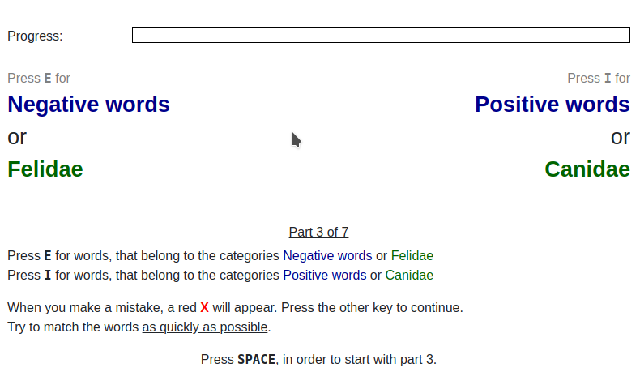
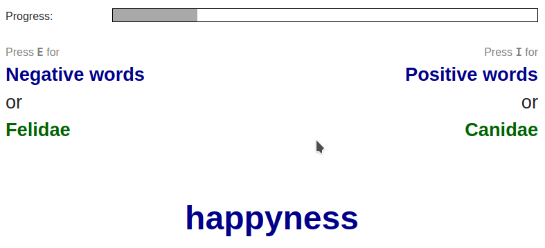

# Implicit Association Test (IAT) experiment for oTree

February 2020, Markus Konrad <markus.konrad@wzb.eu> / [Berlin Social Science Center](https://wzb.eu)

## Introduction

This repository contains an application for [oTree](http://www.otree.org/) ([Chen et al. 2016](http://dx.doi.org/10.1016/j.jbef.2015.12.001)) which implements the Implicit Association Test (IAT) experiment ([Greenwald et al. 1998](https://psycnet.apa.org/buy/1998-02892-004)).

**Trial block introduction:**

**A trial:**

## Features and limitations

- stimuli and trial blocks easily adjustable (see configuration)
- precise measurement of responses in milliseconds
- progress bar showing advancement of trials for each participant 
- each measurement is stored individually in the database
- requires keyboard for responses but may be extended to work on mobile devices as well
- results are transferred to server at the end of each *round* (each round or *block* consists of several trials), *not* after each trial

## Requirements

- tested with Python 3.7 to Python 3.9
- tested with otree 3.3.0 to otree 3.3.11

oTree IAT may work with higher versions than specified here, but this is untested. 

You can install the exact requirements using *pip*: `pip install -r requirements.txt`

If you want to use oTree IAT with an older version of oTree, you may try a previous release as listed under *Releases* on the right side. To know which version of oTree IAT works with which version of oTree, see the *Changes* section below.

## Configuration

### Stimuli and trial blocks

For your own experiment, you probably want to exchange the stimuli and adjust the trials. You can do so in `iat/models.py` by editing `STIMULI`, `STIMULI_LABELS` and `BLOCKS`.

### Further configuration via `Constants`

The `Constants` class in `iat/models.py` contains further configuration settings such as the number of blocks (`num_rounds`) and the keys on the keyboard that are used for input. 

## Code structure and page sequence

### Models

A custom `Trial` class is defined in `iat/models.py` that stores information for each trial per player such as displayed stimulus and participant's response. The trials are set up in `creating_session()` in class `Subsession` where the stimuli are loaded depending on the block definition and their order is randomized. 

### Pages and templates

The page sequence consists of three classes in `iat/pages.py`:

1. `Intro`
2. `IATPage`
4. `Outro`

The test is then implemented in `IATPage`, especially in the JavaScript functions of the HTML template. The randomized `Trial` objects are loaded for the participant for the given round and passed to the template where they are displayed. During the test, the response times and keys are recorded and submitted when the next block is loaded or all blocks are finished. The submitted trial responses are handled and stored to the database in the method `IATPage.before_next_page()`.

## Data export

You can export the data from the "Data" page (`https://<yourserver>/export`) via the *iat (custom)* links.

## Tests

Automated tests are implemented in `iat/tests.py` and can be run via `otree test iat`.

Testing multiple combinations of Python and oTree versions is done using [tox](https://tox.readthedocs.io/). You can install the package *tox* via pip and then run `tox` on the command line.

## Code changes

### 2021-02-18: v1.1.0 (oTree 3.3.x)

- added compatibility with oTree 3.3.x and removed dependency to otreeutils ([PR #3](https://github.com/WZBSocialScienceCenter/otree_iat/pull/3) – thanks to [Christoph Semken](https://github.com/csemken))
- added tox integration for testing multiple Python/oTree versions

### 2019-11-05: v1.0.0 (oTree 2.1.x)

- initial release

## Authors

- [Markus Konrad](https://github.com/internaut) <markus.konrad@wzb.eu>
- [Christoph Semken](https://github.com/csemken) <dev@csemken.eu>

## License

Apache License 2.0. See LICENSE file.
